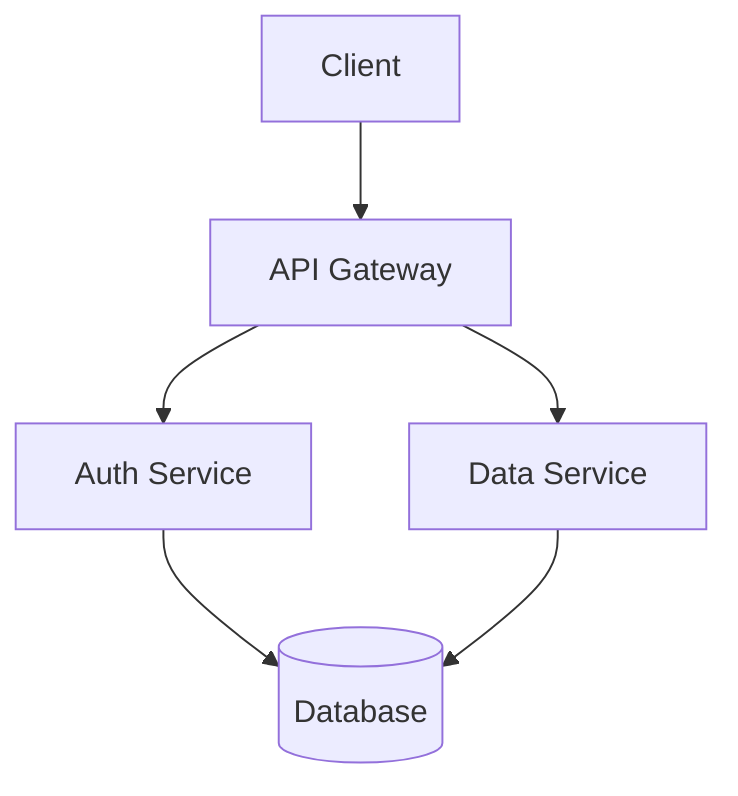

# Visual Element Conventions — Detailed Reference

## When to Use Each Visual Type

**Diagrams:** System architecture, process flows, relationships between components, network topologies, data flow.

**Tables:** Benchmarks, feature comparisons, configuration options, specification matrices, pricing tiers.

**Charts/Graphs:**

* Line charts: trends over time, performance progression

* Bar charts: comparisons between categories, before/after

* Pie charts: composition/proportion (use sparingly, only for 3-5 segments)

* Scatter plots: correlation between variables

**Callout boxes:** Key statistics, expert quotes, important definitions, warnings/notes.

**Screenshots:** UI demonstrations, configuration screens, dashboard examples.

**Code blocks:** Implementation examples, API calls, configuration files.

## Captioning Rules

### Figures (all non-table visuals)

Caption placement: BELOW the figure.

Format:

```
[Visual content here]

Figure 1: Microservices architecture showing service mesh communication patterns.
Source: Adapted from Smith et al. (2025).
```

Rules:

* Sequential numbering: Figure 1, Figure 2, Figure 3...

* Descriptive title that explains what the reader should understand

* Source attribution if data or image is external

* Keep captions to 1-2 sentences

### Tables

Caption placement: ABOVE the table.

Format:

```
Table 1: Performance comparison of container orchestration platforms (requests/second).
Source: Internal benchmarks, January 2026.

| Platform    | Latency (ms) | Throughput | Availability |
|-------------|-------------|------------|--------------|
| Kubernetes  | 12          | 45,000     | 99.99%       |
| Docker Swarm| 18          | 32,000     | 99.95%       |
| Nomad       | 14          | 41,000     | 99.97%       |
```

Rules:

* Sequential numbering separate from figures: Table 1, Table 2, Table 3...

* Clear column headers with units

* Descriptive title explaining the comparison

* Source attribution for external data

## In-Text References

Always reference visuals by their number, never by position.

**Correct:**

* "As shown in Figure 3, the latency decreased significantly after migration."

* "Table 2 compares the three deployment strategies."

* "The architecture (Figure 1) uses a service mesh pattern."

**Incorrect:**

* "As shown in the chart below\..."

* "The following table compares..."

* "See the diagram on the next page..."

Why: Documents are reformatted, paginated differently across devices, and may be read non-linearly. Position-based references break in all these cases.

## Labeling Requirements

Every visual must include:

1. **Numbered caption** (Figure N or Table N)
2. **Descriptive title** that can stand alone
3. **Labeled axes** (for charts/graphs) with units
4. **Legend** (if multiple data series)
5. **Source attribution** (if data is not original)
6. **Alt text** (for accessibility in digital formats)

## Color Guidelines

* Use a consistent color palette throughout the document

* Use color-blind-safe palettes for data visualizations

  * Recommended: blue-orange, blue-red, viridis palette

  * Avoid: red-green combinations

* Do not rely on color alone to convey information — use patterns, labels, or shapes as secondary indicators

* Maintain sufficient contrast for readability (WCAG AA minimum)

## Placement Guidelines

* Place visuals as close as possible to their first reference in text

* Ideally, immediately below the paragraph that first mentions them

* Full-width visuals should appear between paragraphs, not mid-paragraph

* Avoid placing more than 2 visuals on a single page (with no text between them)

* If a visual would split across pages, move it to the top of the next page

## Markdown Formatting for Visuals

For whitepapers authored in markdown:

Architecture diagram (using code block for ASCII or mermaid):

````

````

Comparison table:

```
| Feature | Option A | Option B | Option C |
|---------|----------|----------|----------|
| Speed   | Fast     | Medium   | Slow     |
| Cost    | High     | Medium   | Low      |
```

Image reference:

```

*Figure 1: System architecture showing microservices communication via service mesh.*
```

## Common Mistakes

* Using decorative stock images that add no informational value

* Creating overly complex diagrams that require a legend longer than the diagram

* Using pie charts for more than 5 segments

* Using 3D chart effects (adds visual noise, distorts data perception)

* Inconsistent color coding between related visuals

* Missing units on axes

* Tables with more than 8 columns (split into multiple tables)